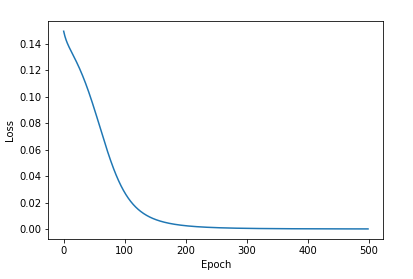

## backpropagation
Raw implementation of backpropagation

Basic backpropagation algorithm implementation using Squared error and sigmoid activation function.

bpnnMain.py is the main script to run. The program uses temporary 2D data.The output change of loss i depicted in figure while using gradient descent optimization. 

## Dependencies
* Python 3
* Matplotlib
* Numpy